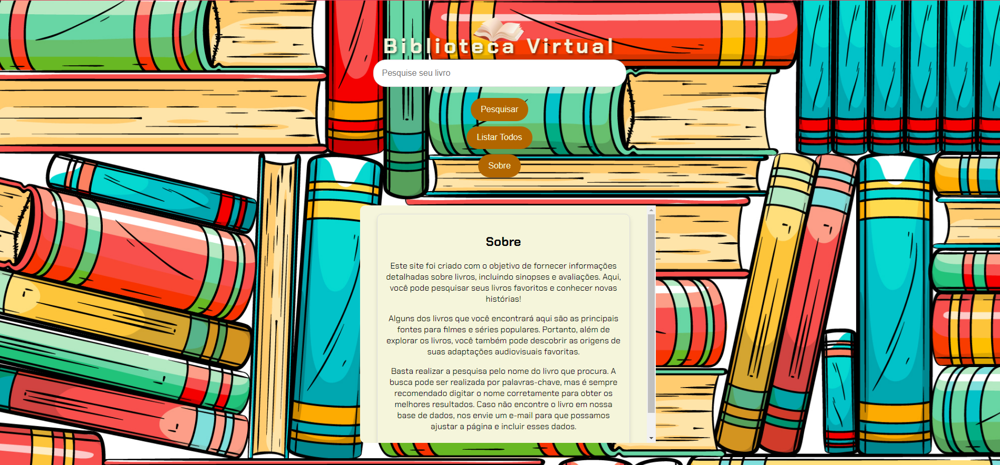

# Projeto Biblioteca Virtual

## Índice
1. [Descrição do Projeto](#descrição-do-projeto)
2. [Estrutura de Arquivos](#estrutura-de-arquivos)
3. [Configuração e Instalação](#configuração-e-instalação)
4. [Uso](#uso)
5. [Tecnologias Utilizadas](#tecnologias-utilizadas)
6. [Funcionalidades](#funcionalidades)
7. [Estilo CSS](#estilo-css)
8. [Como Personalizar](#como-personalizar)
9. [Captura de Tela](#captura-de-tela)
10. [Autor](#autor)

## Descrição do Projeto
Este projeto web tem como objetivo criar uma Biblioteca Virtual interativa, permitindo a pesquisa e visualização de livros de forma intuitiva. 📚
A página inclui um cabeçalho elegante com um GIF animado, um campo de busca para encontrar livros e um rodapé com links para minhas redes sociais.



## Estrutura de Arquivos
A estrutura de arquivos do projeto é organizada da seguinte forma:

- `index.html`: Contém a estrutura principal da página. 📄
- `style.css`: Contém os estilos CSS aplicados ao projeto. 🎨
- `script.js`: Script JavaScript para funcionalidades interativas. 💻
- `fonts/sans-serif`: Fonte personalizada usada para os textos da página. 🔤
- `/img/background.jpg`: Imagem de fundo usada na página. 🖼️

## Configuração e Instalação

1. **Clone o repositório**:
   ```bash
   git clone https://github.com/jeferson-paz/projeto_final_alura_gemini.git
   ```
2. **Navegue até o diretório do projeto**:
   ```bash
   cd projeto_final_alura_gemini
   ```
3. **Abra o arquivo `https://jeferson-paz.github.io/projeto_final_alura_gemini/` no seu navegador**. 🌐

## Uso
Após seguir os passos de instalação, basta abrir o arquivo `https://jeferson-paz.github.io/projeto_final_alura_gemini/` no seu navegador de preferência. A página será carregada com um background temático, um título animado e um campo de busca interativo.

- **Busca de Livros:** Utilize a barra de busca para procurar livros na biblioteca virtual. 🔍
- **Visualização de Detalhes:** Clique nos resultados para ver mais detalhes sobre cada livro. 📖
- **Redes Sociais:** Use os ícones no rodapé para visitar minhas redes sociais e portfólio. 🌟

## Tecnologias Utilizadas
- **HTML5:** Estrutura da página. 🌐
- **CSS3:** Estilização e animações. 🎨
- **JavaScript:** Funcionalidades interativas. 💻
- **Font Awesome:** Para ícones de redes sociais. 👍

## Funcionalidades
- **Animação de Título:** O título "Biblioteca Virtual" é animado usando a propriedade `@keyframes`. ✨
- **Busca Interativa:** Implementação de uma barra de busca para pesquisa de livros com feedback em tempo real. 🔍
- **Rodapé com Links:** Ícones de redes sociais com links para LinkedIn, Instagram, Threads. 🌐

## Estilo CSS
O arquivo `style.css` define os estilos usados na página. Aqui estão alguns detalhes importantes:

- **Fonte Customizada:** Usada a fonte `sans-serif`, que é carregada com a diretiva `@import url`. 🔤
- **Background:** A imagem de fundo é definida com `background-image`, ajustada para cobrir toda a tela e centralizada com `background-size: cover` e `background-position: center`. 🌄
- **Animação de Título:** A animação é criada com a propriedade `@keyframes moveText`, que faz o título se mover horizontalmente. 🎢

## Como Personalizar
- **Alterar a Fonte:** Substitua `sans-serif` no Estilo global `font-family` por outra fonte de sua preferência e atualize o CSS no `@import url`. 🔤
- **Imagem de Fundo:** Substitua `background.jpg` na pasta `img` por outra imagem de sua escolha e atualize a propriedade `background-image` no CSS. 🖼️
- **Redes Sociais:** Edite os links dos ícones no rodapé para redirecionar para suas próprias redes sociais. 🌐

## Captura de Tela
**Figura 1**: Captura de tela mostrando a interface do projeto Biblioteca Virtual. 📸


## Autor
**Jeferson Paz** 👋

- [LinkedIn](https://www.linkedin.com/in/jeferson-paz/) 🔗
- [Instagram](https://www.instagram.com/jeferson.paz_/) 📸
- [GitHub](https://github.com/jeferson-paz) 💻
- [Portfólio](https://jeferson-paz.github.io/Portfolio/) 🌟